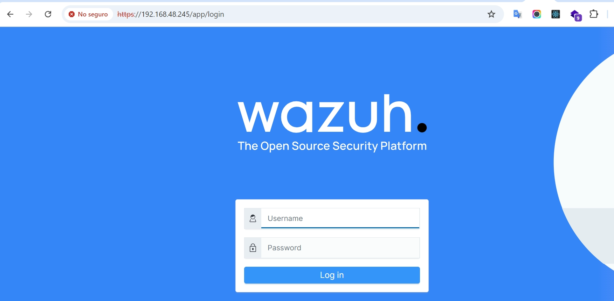
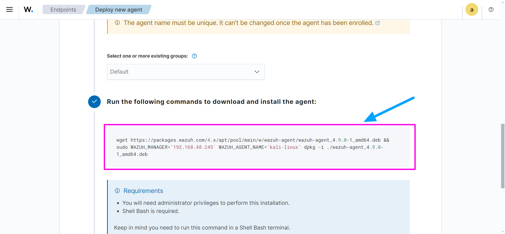

<!-- hide -->
# Configuración de wazuh como EDR

> By [@rosinni](https://github.com/rosinni) and [other contributors](https://github.com/breatheco-de/wazuh-configuration-as-edr/graphs/contributors) at [4Geeks Academy](https://4geeksacademy.co/)

[](https://4geeks.com)
[](https://twitter.com/4geeksacademy)

*Estas instrucciones estan [disponibles en español](https://github.com/breatheco-de/wazuh-configuration-as-edr/blob/main/README.es.md)*

### Antes de empezar...

> ¡Te necesitamos! Estos ejercicios se crean y mantienen en colaboración con personas como tú. Si encuentras algún error o falta de ortografía, contribuye y/o repórtalo.

<!-- endhide -->

<!-- howtostart -->

## 🌱 ¿Cómo empezar este proyecto?

Este ejercicio comprende tres etapas:

- Descargar e instalar Wazuh desde una máquina virtual (según la [documentación oficial](https://documentation.wazuh.com/current/index.html)).
- Descargar e instalar el agente de Wazuh en otra máquina/endpoint (en este caso, usaremos Kali Linux).
- Evaluar o monitorear el EDR (Endpoint Detection and Response) de la máquina Kali en el dashboard de Wazuh.

<!-- endhowtostart -->

## 📝 Instrucciones

## Instalar Wazuh en una maquina para usarla como servidor

Wazuh puede generar alertas en tiempo real basadas en los eventos recopilados en los endpoints, lo que te permite actuar rápidamente ante incidentes de seguridad. Esto es crucial para un EDR efectivo, ya que permite a los equipos de seguridad investigar y responder a amenazas antes de que causen daños. Empecemos con su instalación basada en virtualbox.


1. Descargar la [imagen OVA de Wazuh](https://documentation.wazuh.com/current/deployment-options/virtual-machine/virtual-machine.html#access-the-wazuh-dashboard).
2. **Cambia el controlador gráfico en VirtualBox** Apaga la máquina virtual si está corriendo y ve a la configuración de la máquina en VirtualBox. Navega a la sección de Pantalla (Display) y en la sección de `Controlador gráfico`, selecciona `VMSVGA`.
3. Guarda los cambios, arranca de nuevo la máquina virtual e inicia sesión con las contraseñas proporcionadas en la documentación oficial.

```bash
user: wazuh-user
password: wazuh
```

4. Ejecuta los siguientes comandos para actualizar la máquina:

```bash
sudo -i
```

5. Busca la IP de la máquina y utiliza la IP obtenida para acceder al dashboard de Wazuh desde un navegador con la siguiente url:

```url
https://<IP_DE_TU_MAQUINA>/app/login
```

> 💡 Puedes hacerlo desde tu máquina host.



6. Finalmente logueate en la interfaz de wazuh con las credenciales proporcionadas por la documentación.

```bash
user: admin
password: admin
```

## Configurar los Endpoints

Para realizar una prueba con Wazuh como EDR, puedes agregar algunos endpoints (máquinas con agentes de Wazuh) que simularán la actividad en una red.

Los agentes en Wazuh son un software que se instala en endpoints, como servidores, estaciones de trabajo o dispositivos, para monitorizar la seguridad de esos sistemas. Estos agentes recogen datos y eventos de seguridad desde los endpoints y los envían al Wazuh Manager, donde se analizan para detectar amenazas, vulnerabilidades y anomalías.


### Instalar y configurar el agente de Wazuh en Linux (en nuestro caso kali linux)

1. En la opción `server management > endpoints summary` agregas un nuevo agente. Tendrás una vista como esta.


2. Selecciona el sistema operativo del endpoint que quieres agregar, su arquitectura, la dirección IP del servidor wazuh que creamos anteriormente y una etiqueta/nombre de ese endpoint. Una vez hecho esto, te va generar un comando para que lo ejecutes en el endpoint (en nuestro caso la maquina linux)



3. Una vez que hayas pegado el comando generado por wazuh y se haya realizado la instalación debemos correr los siguientes comandos en la misma maquina endpoint:

```bash
sudo systemctl daemon-reload
sudo systemctl enable wazuh-agent
sudo systemctl start wazuh-agent
```
Si todo sale bien, haz click en cerrar y busca en el panel, los agentes activos. Tendras una vista como esta.


## Monitorear la actividad en el Wazuh Dashboard

Para monitorear cambios y eventos en el dashboard de Wazuh utilizando la funcionalidad de EDR, puedes realizar varias acciones en tu sistema Kali que generen alertas y eventos. 

### Simulación de Amenazas

- [ ] Simula Acceso no autorizado. Intenta iniciar sesión repetidamente con credenciales incorrectas en el endpoint de kali linux. Wazuh debería detectar estos intentos como un comportamiento sospechoso y generar alertas.

- [ ] Simula cambios en archivos y carpetas del endpoint kali linux. POr ejemplo:

    - Modificación de archivos:

    ```bash
    echo "Cambio de prueba en archivo" | sudo tee /etc/hosts
    ```
    Esto agregará una línea al archivo /etc/hosts y será detectado como una modificación.

    - Creación de archivos:

    ```bash
    sudo touch /tmp/archivo_prueba.txt
    ```

    - Eliminación de archivos:

    ```bash
    sudo rm /tmp/archivo_prueba.txt
    ```

    - Cambiar permisos de archivos:

    ```bash
    sudo chmod 777 /etc/hosts
    ```


Después de realizar estas acciones, puedes revisar el dashboard de Wazuh en la opción `Threat Hunting` del endpoint especifico. Verás algo asi:


> ⚠ El panel de Wazuh se actualiza automáticamente cada 15 minutos. Si no ves reflejados los cambios inmediatamente, espera hasta la próxima actualización automática. Si después de 15 minutos no ves los cambios reflejados, revisa los logs del agente para asegurarte de que no haya errores en la configuración o en la conexión al servidor.

¡Listo, lograste instalar wazuh y usarlo como EDR!😎
<!-- hide -->

## Colaboradores

Gracias a estas personas maravillosas ([emoji key](https://github.com/kentcdodds/all-contributors#emoji-key)):

1. [Rosinni Rodriguez (rosinni)](https://github.com/rosinni) contribution: (build-tutorial) ✅, (documentation) 📖
  
2. [Alejandro Sanchez (alesanchezr)](https://github.com/alesanchezr),  contribution: (bug reports) 🐛

Este proyecto sigue la especificación [all-contributors](https://github.com/kentcdodds/all-contributors). ¡Todas las contribuciones son bienvenidas!

Este y otros ejercicios son usados para [aprender a programar](https://4geeksacademy.com/es/aprender-a-programar/aprender-a-programar-desde-cero) por parte de los alumnos de 4Geeks Academy [Coding Bootcamp](https://4geeksacademy.com/us/coding-bootcamp) realizado por [Alejandro Sánchez](https://twitter.com/alesanchezr) y muchos otros contribuyentes. Conoce más sobre nuestros [Cursos de Programación](https://4geeksacademy.com/es/curso-de-programacion-desde-cero?lang=es) para convertirte en [Full Stack Developer](https://4geeksacademy.com/es/coding-bootcamps/desarrollador-full-stack/?lang=es), o nuestro [Data Science Bootcamp](https://4geeksacademy.com/es/coding-bootcamps/curso-datascience-machine-learning).Tambien puedes adentrarte al mundo de ciberseguridad con nuestro [Bootcamp de ciberseguridad](https://4geeksacademy.com/es/coding-bootcamps/curso-ciberseguridad).

<!-- endhide -->
