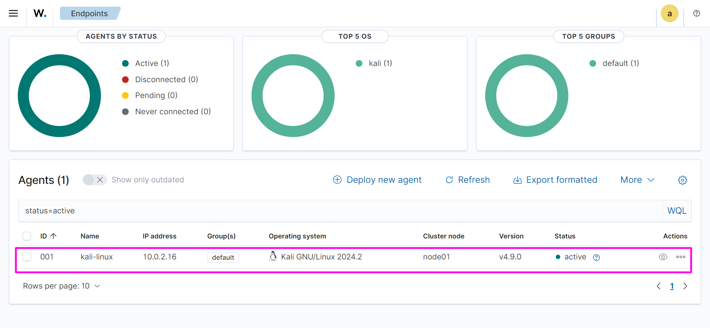

<!-- hide -->
# Wazuh configuration as EDR

> By [@rosinni](https://github.com/rosinni) and [other contributors](https://github.com/breatheco-de/wazuh-configuration-as-edr/graphs/contributors) at [4Geeks Academy](https://4geeksacademy.co/)

[](https://4geeks.com)
[](https://twitter.com/4geeksacademy)

*These instructions are also [available in Spanish](https://github.com/breatheco-de/wazuh-configuration-as-edr/blob/main/README.es.md)*

### Before you start...

> We need you! These exercises are created and maintained in collaboration with people like you. If you find any errors or typos, please contribute and/or report them.
<!-- endhide -->

<onlyfor saas="false" withBanner="false">

## 🌱 How to Start This Project

This exercise comprises three stages:

- Download and install Wazuh from a virtual machine (according to [the official documentation](https://documentation.wazuh.com/current/index.html)).
- Download and install the Wazuh agent on another machine/endpoint (in this case, we will use Kali Linux).
- Evaluate or monitor the EDR (Endpoint Detection and Response) of the Kali machine on the Wazuh dashboard.

</onlyfor>

## 📝 Instructions

## Install Wazuh on a Machine to Use as a Server

Wazuh can generate real-time alerts based on events collected from endpoints, allowing you to act quickly on security incidents. This is crucial for an effective EDR, as it enables security teams to investigate and respond to threats before they cause damage. Let's start with the installation based on VirtualBox.

1. Download the [Wazuh OVA image](https://documentation.wazuh.com/current/deployment-options/virtual-machine/virtual-machine.html#access-the-wazuh-dashboard).
2. **Change the graphics controller in VirtualBox** Turn off the virtual machine if it is running and go to the machine's settings in VirtualBox. Navigate to the Display section, and in the `Graphics Controller` section, select `VMSVGA`.
3. Save the changes, reboot the virtual machine, and log in with the credentials provided in the official documentation.

```bash
user: wazuh-user
password: wazuh
```

4. Run the following commands to update the machine:

```bash
sudo -i
```

5. Find the machine's IP and use the obtained IP to access the Wazuh dashboard from a browser using the following URL:

```url
https://<IP_DE_TU_MAQUINA>/app/login
```

💡 You can do this from your host machine.


6. Finally, log in to the Wazuh interface with the credentials provided in the documentation.

```bash
user: admin
password: admin
```

## Configure the Endpoints

To perform a test with Wazuh as an EDR, you can add some endpoints (machines with Wazuh agents) that will simulate network activity.

Agents in Wazuh are software installed on endpoints, such as servers, workstations, or devices, to monitor the security of those systems. These agents collect security data and events from the endpoints and send them to the Wazuh Manager, where they are analyzed to detect threats, vulnerabilities, and anomalies.

### Install and configure the Wazuh agent on Linux (in our case, Kali Linux)

1. In the server management > endpoints summary option, add a new agent. You will see a view like this.


2. Select the operating system of the endpoint you want to add, its architecture, the IP address of the Wazuh server we created earlier, and a label/name for that endpoint. Once done, it will generate a command for you to run on the endpoint (in our case, the Linux machine).


3. Once you have pasted the command generated by Wazuh and the installation is complete, run the following commands on the same endpoint machine:

```bash
sudo systemctl daemon-reload
sudo systemctl enable wazuh-agent
sudo systemctl start wazuh-agent
```

If everything goes well, click close and look for the active agents in the panel. You will see a view like this.



## Monitor Activity in the Wazuh Dashboard

To monitor changes and events in the Wazuh dashboard using the EDR functionality, you can perform several actions on your Kali system that will generate alerts and events.

### Threat Simulation

- [ ] Simulate Unauthorized Access. Try to repeatedly log in with incorrect credentials on the Kali Linux endpoint. Wazuh should detect these attempts as suspicious behavior and generate alerts.

- [ ] Simulate file and folder changes on the Kali Linux endpoint. For example:

    - File modification:

    ```bash
    echo "Test change in file" | sudo tee /etc/hosts
    ```
    This will add a line to the /etc/hosts file and will be detected as a modification.

    - File creation:

    ```bash
    sudo touch /tmp/test_file.txt
    ```

    - File deletion:

    ```bash
    sudo rm /tmp/test_file.txt
    ```

    - Change file permissions:

    ```bash
    sudo chmod 777 /etc/hosts
    ```

After performing these actions, you can check the Wazuh dashboard under the `Threat Hunting` option for the specific endpoint. You will see something like this:


> ⚠ The Wazuh dashboard updates automatically every 15 minutes. If you don’t see the changes reflected immediately, wait until the next automatic update. If after 15 minutes you still don’t see the changes, check the agent logs to ensure there are no errors in the configuration or in the connection to the server.

You’re all set, you’ve successfully installed Wazuh and used it as an EDR! 😎

<!-- hide -->

## Contributors

Thanks to these amazing people ([emoji key](https://github.com/kentcdodds/all-contributors#emoji-key)):

1. [Rosinni Rodriguez (rosinni)](https://github.com/rosinni) contribution: (build-tutorial) ✅, (documentation) 📖
  
2. [Alejandro Sanchez (alesanchezr)](https://github.com/alesanchezr), contribution: (bug reports) 🐛

This project follows the [all-contributors](https://github.com/kentcdodds/all-contributors) specification. Contributions of any kind are welcome!

This and other exercises are used to [learn to code](https://4geeksacademy.com/us/learn-to-code) by students at 4Geeks Academy [Coding Bootcamp](https://4geeksacademy.com/us/coding-bootcamp) led by [Alejandro Sánchez](https://twitter.com/alesanchezr) and many other contributors. Learn more about our [Programming Courses](https://4geeksacademy.com/us/programming-courses) to become a [Full Stack Developer](https://4geeksacademy.com/us/coding-bootcamps/full-stack-developer), or our [Data Science Bootcamp](https://4geeksacademy.com/us/coding-bootcamps/data-science-machine-learning-bootcamp). You can also dive into cybersecurity with our [Cybersecurity Bootcamp](https://4geeksacademy.com/us/coding-bootcamps/cybersecurity-bootcamp).

<!-- endhide -->
